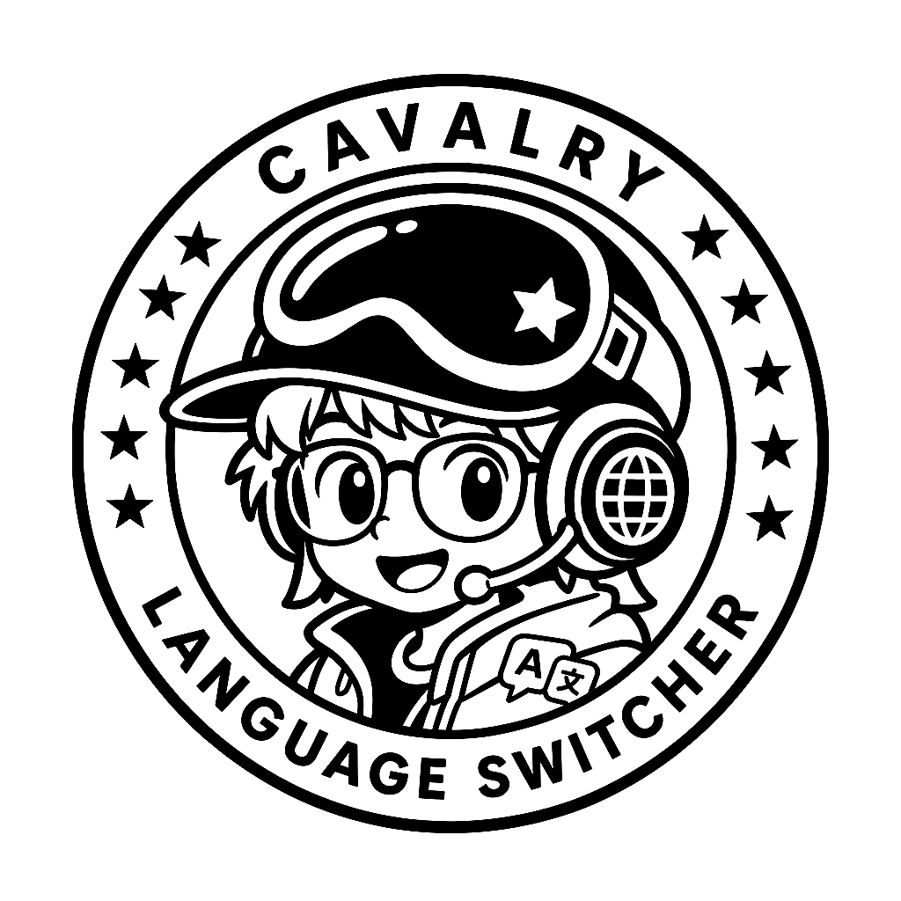
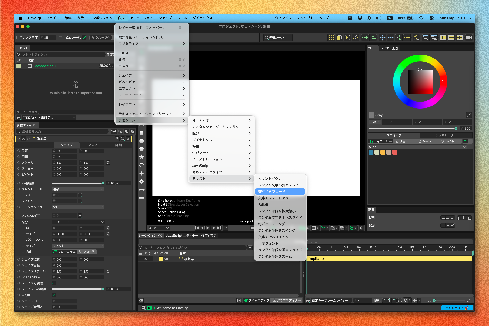

<!--
[INPUT]: 依赖当前发布配置、平台运行时边界与 LOCAL_BUILD_SOP
[OUTPUT]: 对外提供 macOS / Windows 用户安装、使用、开发与安全说明的日本語版
[POS]: リポジトリの日本語ユーザー入口。英語と他のローカライズ README に公開の事実を同期し、実機検証の代替にはしない
[PROTOCOL]: 变更时更新此头部，然后检查 CLAUDE.md
-->

<div align="center">
  
  <h1>Cavalry-i18n</h1>
  <p>macOS または Windows の元のアプリのまま、<a href="https://cavalry.scenegroup.co/">Cavalry</a> 2.7.2 を English、简体中文、繁體中文、日本語に切り替えます。</p>
  <a href="https://github.com/daftAI2026/Cavalry-i18n/stargazers"></a>
  <a href="https://github.com/daftAI2026/Cavalry-i18n/releases"></a>
  <a href="LICENSE"></a>

  <p>Languages: <a href="README.md">English</a> | <a href="README.zh-Hans.md">简体中文</a> | <a href="README.zh-Hant.md">繁體中文</a> | 日本語</p>
</div>

## プレビュー



## 機能

- 🎯 **ワンクリック切り替え**：言語を選び、適用をクリックして再起動すると、Cavalry が翻訳済み UI で開きます
- 🍎🪟 **macOS と Windows**：macOS の `Cavalry.app` と Windows の Cavalry インストールルートに対応します
- 🔌 **プラットフォーム固有のランタイム翻訳**：macOS は `DYLD_INSERT_LIBRARIES`、Windows は小さな vendor QPA delegate の背後で Qt generic translator を使います
- 📦 **2 つの翻訳サーフェス**：JSON アセットファイルと compiled Qt/UI 文字列を自動で処理します
- 🧩 **動的 UI 正規化**：shape 名、Attribute Editor フィールド、コロン付きラベル、`No ...` fallback text など、実行時に生成されるラベルを翻訳します
- 🔑 **macOS の Keychain-safe**：`libExtensionLayer.dylib` にバイナリパッチを適用し、言語切り替え後もログイン認証情報を維持します
- 🔐 **macOS の署名パス**：パッチ済み bundle を再署名し、Gatekeeper フラグを消して macOS にブロックされないようにします
- 📍 **Windows の自動検出と手動選択**：既知のインストールを検出し、見つからない場合は `Cavalry.exe` またはインストールフォルダーを選択できます
- 🌐 **4 言語対応**：English、简体中文、繁體中文、日本語

## 安全性と権限

Cavalry-i18n は独立したコミュニティツールです。Scene Group、Cavalry、Canva が制作、承認、提携しているものではありません。

このプロジェクトは **macOS と Windows x64** をサポートします。macOS では `Cavalry.app` bundle をパッチして再署名します。Windows では選択した Cavalry インストールルートに JSON overlay と hash-locked QPA delegate を適用し、元の `qwindows.dll` を永続バックアップします。デスクトップ、スタートメニュー、タスクバー、直接 EXE の各起動経路は書き換えません。Linux は未対応です。

このツールは、翻訳済みリソースで Cavalry を起動できるように、ローカルの `Cavalry.app` bundle 内のファイルを変更します。macOS では、この操作に **App Management** 権限が必要です。

1. **System Settings → Privacy & Security → App Management** を開く
2. **Cavalry Language Switcher** を有効にする
3. アプリに戻り、もう一度 language pack を適用する

macOS がこの権限を求めるのは、別の `.app` bundle を変更する操作が保護対象だからです。このビルドを信頼し、ローカルの Cavalry インストールにパッチ、再署名、再起動が行われることを理解した場合にのみ許可してください。クリーンな Cavalry インストーラーまたはバックアップを保持してください。未変更の公式 bundle に戻す最も安全な方法は Cavalry を再インストールすることです。

Windows では、まずローカルのインストールを検出します。見つからない場合は `Cavalry.exe` またはそのインストールフォルダーを手動で選択してください。カスタムパスも利用できますが、現在のユーザーが書き込める必要があります。自動 UAC 昇格は、実際に Windows Program Files 配下にあるインストールだけに限定され、任意のカスタムパスには使われません。Cavalry または Switcher の通常終了、Switcher の同一バージョン `/UPDATE`、Switcher のアンインストールでは、選択中の言語を解除せず、Cavalry インストールルート側の外部 QPA ファイルを復元・削除しません。English を明示的に選んだ場合にのみ、英語アセットのスナップショットと検証済みの vendor QPA を復元します。すべての vendor ファイルを完全な初期状態へ戻す最も確実な方法は、引き続き Cavalry の再インストールです。

## Release からインストール

GitHub Releases からプラットフォームに合うアセットをダウンロードしてください。macOS は Apple Silicon または Intel 用 DMG を選びます。DMG は ad-hoc 署名されていますが、Apple Developer ID notarization はまだ行っていません。app を Applications にドラッグした後に macOS が "Apple could not verify Cavalry Language Switcher is free of malware" と表示する場合は、ブラウザダウンロード由来の quarantine フラグを一度だけ削除してください。

```bash
xattr -dr com.apple.quarantine "/Applications/Cavalry Language Switcher.app"
open "/Applications/Cavalry Language Switcher.app"
```

Windows では `Cavalry.Language.Switcher_Cavalry-2.7.2-pN_windows-x64-setup.exe` をダウンロードして実行します。NSIS インストーラーは language switcher のみをインストールします。エンドユーザーが Python、Rust、Qt、PowerShell 7 を入れる必要はありません。インストール後は検出された Cavalry を選ぶか、現在のユーザーが書き込めるインストールルートを指定してください。

開発者はソースからローカルビルドすることもできます。ローカルビルドは [LOCAL_BUILD_SOP.md](LOCAL_BUILD_SOP.md) に従い、ブラウザダウンロードの quarantine フラグを持ちません。

AI agent にこのプロンプトを渡すこともできます。

```text
Build Cavalry Language Switcher locally from source:

1. Open the repository at /Users/luo/Desktop/ClaudeCode/web/Cavalry-i18n.
2. Follow LOCAL_BUILD_SOP.md exactly.
3. Run the standard Tauri build, stamp the DMG icon, and run the packaged checks described in the SOP.
4. Confirm the final DMG path when done.
```

## クイックスタート

```bash
npm install
npm run tauri:dev        # 開発モード
npm run build            # 本番ビルド
npm run build:tauri      # 本番 DMG + packaged checks
```

Windows 開発ビルド:

```powershell
npm run build:tauri:windows    # Windows NSIS インストーラー
```

Windows 開発には Windows 10 x64 以降、Node.js 22+、PowerShell 5.1+、x64 MSVC v143 を含む Visual Studio 2022+、CMake 4.2+ が必要です。ランチャーはインストール済みの `pwsh` を優先し、なければ標準搭載の Windows PowerShell を使用します。

> **注意**：両プラットフォームの injector は、Cavalry 2.7.2 に同梱されている Qt ブランチと一致する Qt 6.6.3 に対してビルドする必要があります。`tools/cavalry_qt_target.json` を唯一のバージョン情報源とし、macOS `clang_64` と Windows `msvc2019_64` へ投影します。clean Windows ビルドでは `npm run prepare:qt-sdk:windows` を使用します。

## 仕組み

1. macOS の `Cavalry.app` を **検出**、または Windows の `Cavalry.exe` インストールルートを検出/選択
2. 現在の English JSON アセットをバージョン付きスナップショットとして **抽出**
3. `languages/` の翻訳 JSON ファイルをアプリの assets に **パッチ適用**
4. macOS の launcher wrapper と injector、または選択ルートの Windows `generic/cavalryi18n.dll` translator と root QPA delegate を **インストール**
5. Cavalry を **再起動** してプラットフォーム固有の翻訳を読み込む。macOS では bundle の再署名と Gatekeeper quarantine の解除も行う

パッチ後も、元の起動パスはそのまま使えます。macOS の launcher wrapper は `DYLD_INSERT_LIBRARIES` を設定します。Windows は Cavalry が必ず通る native QPA path から同じ翻訳 runtime を読み込み、グローバル環境変数や特定のショートカットには依存しません。元の `qwindows.dll` は hash-locked recovery directory に保持され、Cavalry/Switcher の通常終了、Switcher の同一バージョン `/UPDATE`、Switcher のアンインストールでは、この外部 QPA 状態を変更しません。English を明示的に選んだ場合にのみ、抽出済みアセットスナップショットと検証済みの vendor QPA を使って復元します。

## 対応言語

| 言語 | コード |
|----------|------|
| English | `en` |
| 简体中文 | `zh-Hans` |
| 繁體中文 | `zh-Hant` |
| 日本語 | `ja_JP` |

## 開発

```bash
# ビルド
npm run build                  # Tauri 本番ビルド
npm run build:tauri            # フルパイプライン：ビルド + DMG アイコン付与 + packaged check
npm run build:injector         # libCavalryTranslatorInjector.dylib をコンパイル
npm run prepare:qt-sdk         # Qt 6.6.3 SDK をダウンロード/解決
npm run prepare:qt-sdk:windows # Qt 6.6.3 msvc2019_64 を取得/検証
npm run build:injector:windows # Windows Qt generic translator + QPA delegate をビルド/テスト
npm run build:tauri:windows    # Windows NSIS インストーラーをビルド
npm run test:tauri:windows-nsis # provenance を再計算し、インストール、同一バージョン更新、アンインストールを検証

# 開発
npm run tauri:dev              # Tauri dev server
npm run check:tauri            # Rust type-check

# テスト
npm run test:contracts         # Node：app、renderer、bridge、SOP contract tests
npm run test:tauri             # cargo test（Rust unit + contract tests）
npm run test:tauri:packaged    # ビルド済みリソース整合性
npm run test:tauri:ui          # packaged window regression
npm run check:app              # すべての JS を構文チェック
npm run check:full-ui          # Full JSON + compiled + runtime UI gate（100%）
```

Windows パッケージング後には、同名の `.exe.provenance.json` sidecar が作られます。これはインストーラーのバイト列を、現在の renderer、言語パック、Windows Tauri/Rust 入力、package manifests、2 つの Windows injector DLL に結び付けます。NSIS smoke はインストール前に再計算し、両方が x64 で第 2 の Qt runtime を同梱していないことも検証します。ビルドが削除するのは現在のバージョン用の予期された旧出力だけで、target bundle ディレクトリ内の他の古いインストーラーまたは sidecar は fail-closed になります。

## AI / Agent Guide

このリポジトリには、AI agent 向けのナレッジベースがあります。

- `AGENTS.md` — AI coding agent の運用ガイド：project map、conventions、anti-patterns、commands、build pipeline、safety boundaries
- `CLAUDE.md` — リポジトリルートの architecture map。ルートまたはモジュール構造を変更した場合は更新してください
- モジュール単位の `CLAUDE.md` — `renderer/`、`src-tauri/`、`tools/`、`docs/` などのローカルマップ

AI agent を使う場合は、コード変更の前に `AGENTS.md`、`CLAUDE.md`、最寄りのモジュール単位 `CLAUDE.md` を読むよう依頼してください。

## 翻訳サーフェス

このプロジェクトには **2 つ** の翻訳サーフェスがあります。

1. **JSON-backed assets** — `nodeStrings`、`appStrings`、`tips`、`onboarding`、definitions、metadata、guide、style、plugin files。app bundle に直接パッチされます。
2. **Compiled Qt/UI text** — Cavalry バイナリ内に埋め込まれた menu labels、actions、panel titles、widget text、buttons、tabs。macOS injector または Windows generic translator によってランタイムで翻訳されます。

injector は、Cavalry がランタイムで生成する UI text も正規化します。対象には、派生 shape layer names、Attribute Editor labels、colon-suffixed labels、status counts、mixed `No ...` fallback labels が含まれます。これにより、考えられるすべての phrase を静的翻訳テーブルへ詰め込まずに、生成 UI を読みやすく保てます。

Surface 2 は 3 つの形式で追跡します。
- `~/Library/Caches/Cavalry-i18n/compiled-ui-source-map.json` — 生成された ownership map（JSON vs compiled binary）
- `tools/*.ts` — Qt Linguist XML translation sources
- `$SESSION_DIR/runtime/<language>-merged-inventory.json` — injector と accessibility capture からマージされた live runtime UI inventory

```bash
export SESSION_DIR="$HOME/Library/Caches/Cavalry-i18n/sessions/<session-id>"
npm run extract:compiled-ui                         # Cavalry.app から source map を更新
# 各ターゲット言語で Cavalry を起動して capture    # runtime inventories を生成
npm run check:full-ui                               # Gate：100% 必須
```

## リポジトリ

```
Cavalry-i18n/
├── renderer/                     # UI（vanilla HTML/CSS/JS + Tauri bridge）
├── injector/                     # Objective-C++ runtime translator + generated table
├── src-tauri/                    # Tauri v2 shell（Rust）
│   └── src/
│       ├── commands.rs           # Tauri IPC commands（business core）
│       ├── keychain_patch.rs     # Mach-O binary patching
│       ├── privilege.rs          # system command boundary
│       └── ...
├── languages/                    # JSON language packs（en、zh-Hans、zh-Hant、ja_JP）
├── tools/                        # build、test、coverage scripts、gate contracts
├── docs/                          # architecture plans、translation rules、workflow evidence
├── output/                       # derived audit artifacts、JSON surface evidence
└── .github/workflows/            # CI：contract → packaging → release
```

## CI/CD

| Job | Runner | What |
|-----|--------|------|
| **build** | ubuntu | 構文チェック、contract tests、translation validation |
| **windows_check** | windows | Qt generic/QPA の build/test、Rust check、Windows NSIS installer |
| **package_macos** | macos | Qt SDK preparation、Tauri build、Rust contracts、packaged checks |
| **release** | ubuntu | `cavalry-*-p*` tags で発火し、2 つの DMG と Windows x64 NSIS EXE を公開 |

## サポート

- Cavalry-i18n が役に立ったら、友人に[共有](https://twitter.com/intent/tweet?url=https://github.com/daftAI2026/Cavalry-i18n&text=Cavalry-i18n%20-%20Switch%20Cavalry%E2%80%99s%20UI%20between%20English,%20Chinese,%20and%20Japanese%20with%20one%20click.)するか star を付けてください。
- アイデアや bug があれば、issue または PR を開いてください。あなたの最高の AI model での貢献も歓迎します。

## ライセンス

MIT License。Cavalry-i18n を自由に使い、ぜひ貢献してください。
