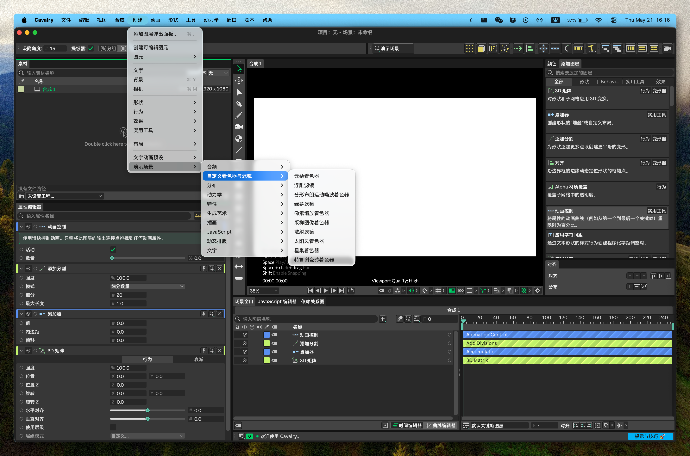

<!--
[INPUT]: 依赖当前发布配置、平台运行时边界与 LOCAL_BUILD_SOP
[OUTPUT]: 对外提供 macOS / Windows 用户安装、使用、开发与安全说明的简体中文版本
[POS]: 仓库简体中文用户入口；与英文及其他本地化 README 同步发布真相，不替代平台真机验收
[PROTOCOL]: 变更时更新此头部，然后检查 CLAUDE.md
-->

<div align="center">
  
  <h1>Cavalry-i18n</h1>
  <p>直接在 macOS 或 Windows 原始应用中，将 <a href="https://cavalry.scenegroup.co/">Cavalry</a> 2.7.2 切换为 English、简体中文、繁體中文或日本語。</p>
  <a href="https://github.com/daftAI2026/Cavalry-i18n/stargazers"></a>
  <a href="https://github.com/daftAI2026/Cavalry-i18n/releases"></a>
  <a href="LICENSE"></a>

  <p>Languages: <a href="README.md">English</a> | 简体中文 | <a href="README.zh-Hant.md">繁體中文</a> | <a href="README.ja_JP.md">日本語</a></p>
</div>

## 预览



## 功能

- 🎯 **一键切换**：选择语言，点击应用，重新启动后 Cavalry 即以目标语言打开
- 🍎🪟 **macOS 与 Windows**：支持 macOS `Cavalry.app` 及 Windows Cavalry 安装根
- 🔌 **平台原生运行时翻译**：macOS 使用 `DYLD_INSERT_LIBRARIES`；Windows 在轻量原厂 QPA 委托层后部署 Qt generic translator
- 📦 **双翻译面**：JSON 资源文件 + 编译进 Qt/UI 的字符串，自动统一处理
- 🧩 **动态 UI 规则化**：运行时翻译形状名称、属性编辑器字段、冒号后缀标签和 `No ...` fallback 文本等生成标签
- 🔑 **macOS Keychain 安全**：对 `libExtensionLayer.dylib` 做二进制补丁，避免语言切换后登录凭据失效
- 🔐 **macOS 签名路径**：重新签名补丁后的 app bundle，并清除 Gatekeeper 标记，避免 macOS 阻止启动
- 📍 **Windows 自动发现与手动选址**：尽量发现现有安装；失败时可选择 `Cavalry.exe` 或安装目录
- 🌐 **四种语言**：English、简体中文、繁體中文、日本語

## 安全与权限

Cavalry-i18n 是独立的社区工具。它不是 Scene Group、Cavalry 或 Canva 制作、认可或关联的官方工具。

本项目支持 **macOS 与 Windows x64**。macOS 会补丁并重新签名 `Cavalry.app` bundle；Windows 会在用户选定的 Cavalry 安装根应用 JSON overlay、安装 hash-locked QPA 委托层，并持久备份原厂 `qwindows.dll`。桌面、开始菜单、任务栏和直接 EXE 启动入口都不会被改写。Linux 暂不支持。

这个工具会修改你本机 `Cavalry.app` bundle 内的文件，让 Cavalry 能以翻译后的资源启动。在 macOS 上，这需要 **App Management** 权限：

1. 打开 **System Settings → Privacy & Security → App Management**
2. 启用 **Cavalry Language Switcher**
3. 回到应用，再次应用语言包

macOS 要求这个权限，是因为修改另一个 `.app` bundle 属于受保护操作。只有在你信任此构建，并理解它会补丁、重新签名并重新启动本机 Cavalry 安装时，才授予权限。请保留干净的 Cavalry 安装器或备份；重新安装 Cavalry 是恢复到未修改官方 bundle 的最安全方式。

在 Windows 上，应用会先尝试发现本机安装；失败时请手动选择 `Cavalry.exe` 或其安装目录。支持自定义目录，但该目录必须允许当前用户写入。自动 UAC 提权严格限于实际位于 Windows Program Files 下的安装；任意自定义路径不会因此提权。正常关闭 Cavalry/Switcher 与同版本 `/UPDATE` 都会保留当前语言。交互卸载时可明确选择“仅卸载 Switcher 并保留已部署翻译”，或“先恢复 English，再移除经哈希证明属于本项目的 generic/QPA 运行时”；静默、被动和更新卸载默认保留翻译。若 Cavalry 在翻译态上被重新安装，Switcher 只有在全部受管 JSON 与精确原厂 QPA 都证明现实为英文时才显示 English；点击“刷新英文”会安全收敛旧 marker 与自有运行时残留，未知 DLL 永不删除。

## 从 Release 安装

请从 GitHub Releases 下载对应平台的资产。macOS 请按 Apple Silicon 或 Intel 下载 DMG。新的加固 tag 流水线要求 Developer ID 签名、公证以及同次 Release 的 `SHA256SUMS`、`CycloneDX.json`、`release-asset-provenance.json`、独立签名的 acceptance attestation 与最终 Ed25519 `ReleaseAcceptanceSeal.json`；**历史 p1-p5 Release 早于该流水线，不具备这些保证**。在 `SECURITY.md` 通过独立受保护渠道发布 acceptance authority 与 release seal 两枚不同 fingerprint 之前，不要把任一文件的内嵌公钥本身当作可信锚；加固验证必须先验 acceptance attestation，再验最终 seal。

Windows 请下载并运行 `Cavalry.Language.Switcher_Cavalry-2.7.2-pN_windows-x64-setup.exe`。NSIS 安装器只安装语言切换器；最终用户无需安装 Python、Rust、Qt 或 PowerShell 7。安装后选择自动发现到的 Cavalry，或浏览到当前用户可写的安装根。Windows Authenticode 签名另开 issue 跟踪；务必核对 `SHA256SUMS`。

开发者也可以从源码本地构建。本地构建遵循 [LOCAL_BUILD_SOP.md](LOCAL_BUILD_SOP.md)，仅使用 ad-hoc 签名供开发验证，不能代替 GitHub Release 分发。

也可以把这段话发给你的 AI agent：

```text
请从源码本地构建 Cavalry Language Switcher：

1. 打开仓库 <repository-path>。
2. 严格按照 LOCAL_BUILD_SOP.md 执行。
3. 运行标准 Tauri build、执行 DMG 卷宗图标盖章，并运行 SOP 里的 packaged checks。
4. 完成后告诉我最终 DMG 路径。
```

## 快速开始

```bash
npm install
npm run tauri:dev        # 开发模式
npm run build            # 生产构建
npm run build:tauri      # 生产 DMG + 打包后检查
```

Windows 开发构建：

```powershell
npm run build:tauri:windows    # Windows NSIS 安装器
```

Windows 开发要求 Windows 10 x64 或更高版本、Node.js 22+、PowerShell 5.1+、带 x64 MSVC v143 的 Visual Studio 2022+，以及 CMake 4.2+。启动器优先使用已安装的 `pwsh`，否则使用系统自带的 Windows PowerShell。

> **注意**：两条平台 injector 都必须基于 Qt 6.6.3 构建，以匹配 Cavalry 2.7.2 随附的 Qt 分支。`tools/cavalry_qt_target.json` 是唯一版本真相，并分别投影到 macOS `clang_64` 与 Windows `msvc2019_64`；clean Windows 构建使用 `npm run prepare:qt-sdk:windows`。

## 工作原理

1. **检测** macOS 的 `Cavalry.app`，或发现/选择 Windows 的 `Cavalry.exe` 安装根
2. **提取** 当前英文 JSON 资源，作为带版本的快照
3. **补丁** 将 `languages/` 中的翻译 JSON 文件写入应用资源
4. **安装** macOS launcher wrapper 与 injector，或将 Windows `generic/cavalryi18n.dll` translator 与根 QPA 委托层部署到所选安装根
5. **重新启动** Cavalry 并加载平台运行时翻译；macOS 还会重新签名 bundle 并清除 Gatekeeper 隔离标记

补丁完成后，原来的启动路径仍然可用。macOS 的 launcher wrapper 会设置 `DYLD_INSERT_LIBRARIES`；Windows 从 Cavalry 原生 QPA 必经路径加载同一翻译运行时，不依赖全局环境或特定快捷方式。原厂 `qwindows.dll` 会保存在 hash-locked 恢复目录中。正常退出与同版本更新保留已部署翻译；明确选择 English 或在卸载器中选择恢复，会还原资源与原厂 QPA，并只删除 manifest 证明属于本项目的 generic/recovery 文件，绝不猜测或删除未知 DLL。

## 支持语言

| 语言 | 代码 |
|----------|------|
| English | `en` |
| 简体中文 | `zh-Hans` |
| 繁體中文 | `zh-Hant` |
| 日本語 | `ja_JP` |

## 开发

```bash
# 构建
npm run build                  # Tauri 生产构建
npm run build:tauri            # 完整流水线：构建 + DMG 图标标记 + 打包后检查
npm run build:injector         # 编译 libCavalryTranslatorInjector.dylib
npm run prepare:qt-sdk         # 下载/解析 Qt 6.6.3 SDK
npm run prepare:qt-sdk:windows # 下载/验证 Qt 6.6.3 msvc2019_64
npm run build:injector:windows # 构建/测试 Windows Qt generic translator + QPA delegate
npm run build:tauri:windows    # 构建 Windows NSIS 安装器
npm run test:tauri:windows-nsis # 复算 provenance，并验证安装、同版本更新与卸载

# 开发
npm run tauri:dev              # Tauri 开发服务器
npm run check:tauri            # Rust 类型检查

# 测试
npm run test:contracts         # Node：app、renderer、bridge、SOP 合同测试
npm run test:tauri             # cargo test（Rust 单元测试 + 合同测试）
npm run test:tauri:packaged    # 打包后资源完整性
npm run test:tauri:ui          # 打包后窗口回归
npm run check:app              # 检查所有 JS 语法
npm run check:full-ui          # 完整 JSON + compiled + runtime UI gate（100%）
```

Windows 打包完成后会生成同名 `.exe.provenance.json` sidecar，将安装器字节与当前 renderer、语言包、Windows Tauri/Rust 输入、package manifests 和两个 Windows injector DLL 绑定；NSIS smoke 会在安装前重新计算，并验证二者均为 x64 且没有捆绑第二套 Qt runtime。构建只会移除当前版本的预期旧输出，目标 bundle 目录中存在任何其他遗留安装器或 sidecar 都会 fail-closed。

## AI / Agent Guide

本仓库包含面向 AI agent 的知识库：

- `AGENTS.md` —— AI coding agent 操作指南：项目地图、约定、反模式、命令、构建流水线与安全边界
- `CLAUDE.md` —— 仓库根级架构地图；根目录或模块结构变化时必须同步更新
- 模块级 `CLAUDE.md` —— `renderer/`、`src-tauri/`、`tools/`、`docs/` 等目录的局部地图

使用 AI agent 时，请先要求它读取 `AGENTS.md`、`CLAUDE.md` 和最近的模块级 `CLAUDE.md`，再开始修改代码。

## 翻译面

本项目有 **两个** 翻译面：

1. **JSON-backed assets** —— `nodeStrings`、`appStrings`、`tips`、`onboarding`、definitions、metadata、guide、style 和 plugin 文件。它们会直接补丁进 app bundle。
2. **Compiled Qt/UI text** —— Cavalry 二进制内嵌的菜单标签、action、面板标题、widget 文本、按钮和 tab。它们由 macOS injector 或 Windows generic translator 在运行时翻译。

injector 还会规则化 Cavalry 在运行时生成的 UI 文本，包括派生形状图层名、Attribute Editor 标签、冒号后缀标签、状态计数，以及混合 `No ...` fallback 标签。这样能让生成式 UI 保持可读，而不用把每一种可能短语都塞进静态翻译表。

Surface 2 以三种形式追踪：
- `~/Library/Caches/Cavalry-i18n/compiled-ui-source-map.json` —— 生成的归属映射（JSON vs compiled binary）
- `tools/*.ts` —— Qt Linguist XML 翻译源
- `$SESSION_DIR/runtime/<language>-merged-inventory.json` —— 由 injector 与 accessibility capture 合并出的 live runtime UI inventory

```bash
export SESSION_DIR="$HOME/Library/Caches/Cavalry-i18n/sessions/<session-id>"
npm run extract:compiled-ui                         # 从 Cavalry.app 刷新 source map
# 启动并捕获每个目标语言的 Cavalry             # 生成 runtime inventories
npm run check:full-ui                               # Gate：必须达到 100%
```

## 仓库结构

```
Cavalry-i18n/
├── renderer/                     # UI（vanilla HTML/CSS/JS + Tauri bridge）
├── injector/                     # Objective-C++ runtime translator + generated table
├── src-tauri/                    # Tauri v2 shell（Rust）
│   └── src/
│       ├── commands.rs           # Tauri IPC commands（业务核心）
│       ├── keychain_patch.rs     # Mach-O 二进制补丁
│       ├── privilege.rs          # 系统命令边界
│       └── ...
├── languages/                    # JSON 语言包（en、zh-Hans、zh-Hant、ja_JP）
├── tools/                        # 构建、测试、覆盖率脚本与 gate contracts
├── docs/                          # 架构计划、翻译规则、workflow evidence
├── output/                       # 派生审计产物与 JSON surface evidence
└── .github/workflows/            # CI：contract → packaging → release
```

## CI/CD

| Job | Runner | What |
|-----|--------|------|
| **build** | ubuntu | 语法检查、合同测试、翻译验证 |
| **windows_check** | windows | Qt generic/QPA 构建/测试、Rust 检查、Windows NSIS 安装器 |
| **package_macos** | macos | Qt SDK 准备、Tauri 构建、Rust contracts、打包后检查 |
| **release** | ubuntu | 由 `cavalry-*-p*` tag 触发，发布两个 DMG 与一个 Windows x64 NSIS EXE |

## 支持

- 如果 Cavalry-i18n 帮到了你，可以把它[分享](https://twitter.com/intent/tweet?url=https://github.com/daftAI2026/Cavalry-i18n&text=Cavalry-i18n%20-%20Switch%20Cavalry%E2%80%99s%20UI%20between%20English,%20Chinese,%20and%20Japanese%20with%20one%20click.)给朋友，或点一个 star。
- 有想法或 bug？欢迎开 issue 或 PR，也欢迎贡献你最好的 AI model。

## 许可证

MIT License。欢迎使用 Cavalry-i18n 并参与贡献。
