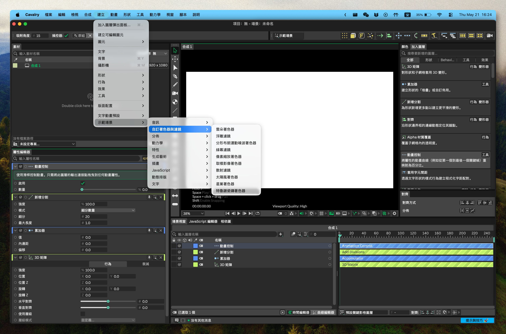

<!--
[INPUT]: 依赖当前发布配置、平台运行时边界与 LOCAL_BUILD_SOP
[OUTPUT]: 对外提供 macOS / Windows 用户安装、使用、开发与安全说明的繁體中文版本
[POS]: 倉庫繁體中文使用者入口；與英文及其他本地化 README 同步發布真相，不替代平台真機驗收
[PROTOCOL]: 变更时更新此头部，然后检查 CLAUDE.md
-->

<div align="center">
  
  <h1>Cavalry-i18n</h1>
  <p>直接在 macOS 或 Windows 原始應用程式中，將 <a href="https://cavalry.scenegroup.co/">Cavalry</a> 2.7.2 切換為 English、簡體中文、繁體中文或日本語。</p>
  <a href="https://github.com/daftAI2026/Cavalry-i18n/stargazers"></a>
  <a href="https://github.com/daftAI2026/Cavalry-i18n/releases"></a>
  <a href="LICENSE"></a>

  <p>Languages: <a href="README.md">English</a> | <a href="README.zh-Hans.md">简体中文</a> | 繁體中文 | <a href="README.ja_JP.md">日本語</a></p>
</div>

## 預覽



## 功能

- 🎯 **一鍵切換**：選擇語言，點擊套用，重新啟動後 Cavalry 即以目標語言開啟
- 🍎🪟 **macOS 與 Windows**：支援 macOS `Cavalry.app` 及 Windows Cavalry 安裝根
- 🔌 **平台原生執行階段翻譯**：macOS 使用 `DYLD_INSERT_LIBRARIES`；Windows 在輕量原廠 QPA 委派層後部署 Qt generic translator
- 📦 **雙翻譯面**：JSON 資源檔案 + 編譯進 Qt/UI 的字串，皆自動統一處理
- 🧩 **動態 UI 規則化**：執行階段翻譯形狀名稱、屬性編輯器欄位、冒號後綴標籤和 `No ...` fallback 文字等生成標籤
- 🔑 **macOS Keychain 安全**：對 `libExtensionLayer.dylib` 做二進位補丁，避免語言切換後登入憑證失效
- 🔐 **macOS 簽名路徑**：重新簽名補丁後的 app bundle，並清除 Gatekeeper 標記，避免 macOS 阻止啟動
- 📍 **Windows 自動探索與手動選址**：盡量探索現有安裝；失敗時可選擇 `Cavalry.exe` 或安裝目錄
- 🌐 **四種語言**：English、簡體中文、繁體中文、日本語

## 安全與權限

Cavalry-i18n 是獨立的社群工具。它不是 Scene Group、Cavalry 或 Canva 製作、認可或關聯的官方工具。

本專案支援 **macOS 與 Windows x64**。macOS 會補丁並重新簽名 `Cavalry.app` bundle；Windows 會在使用者選定的 Cavalry 安裝根套用 JSON overlay、安裝 hash-locked QPA 委派層，並持久備份原廠 `qwindows.dll`。桌面、開始功能表、工作列與直接 EXE 啟動入口都不會被改寫。Linux 暫不支援。

這個工具會修改你本機 `Cavalry.app` bundle 內的檔案，讓 Cavalry 能以翻譯後的資源啟動。在 macOS 上，這需要 **App Management** 權限：

1. 開啟 **System Settings → Privacy & Security → App Management**
2. 啟用 **Cavalry Language Switcher**
3. 回到應用程式，再次套用語言包

macOS 要求這個權限，是因為修改另一個 `.app` bundle 屬於受保護操作。只有在你信任此構建，並理解它會補丁、重新簽名並重新啟動本機 Cavalry 安裝時，才授予權限。請保留乾淨的 Cavalry 安裝器或備份；重新安裝 Cavalry 是恢復到未修改官方 bundle 的最安全方式。

在 Windows 上，應用程式會先嘗試探索本機安裝；失敗時請手動選擇 `Cavalry.exe` 或其安裝目錄。支援自訂目錄，但該目錄必須允許目前使用者寫入。自動 UAC 提權嚴格限於實際位於 Windows Program Files 下的安裝；任意自訂路徑不會因此提權。正常關閉 Cavalry 或 Switcher、透過同版本 `/UPDATE` 路徑更新 Switcher、解除安裝 Switcher，都不會撤銷目前語言，也不會還原或刪除 Cavalry 安裝根中的外部 QPA 檔案。只有明確選擇 English 才會還原英文資源快照與已驗證的原廠 QPA。若要把所有廠商檔案恢復為完全原始狀態，重新安裝 Cavalry 仍是最穩妥的方式。

## 從 Release 安裝

請從 GitHub Releases 下載對應平台的資產。macOS 請依 Apple Silicon 或 Intel 下載 DMG。DMG 使用 ad-hoc 簽名，但尚未經過 Apple Developer ID notarization。如果把 app 拖入 Applications 後，macOS 提示 "Apple could not verify Cavalry Language Switcher is free of malware"，請先清除一次瀏覽器下載帶來的 quarantine 標記：

```bash
xattr -dr com.apple.quarantine "/Applications/Cavalry Language Switcher.app"
open "/Applications/Cavalry Language Switcher.app"
```

Windows 請下載並執行 `Cavalry.Language.Switcher_Cavalry-2.7.2-pN_windows-x64-setup.exe`。NSIS 安裝器只安裝語言切換器；最終使用者無需安裝 Python、Rust、Qt 或 PowerShell 7。安裝後選擇自動探索到的 Cavalry，或瀏覽到目前使用者可寫的安裝根。

開發者也可以從原始碼本地構建。本地構建遵循 [LOCAL_BUILD_SOP.md](LOCAL_BUILD_SOP.md)，不會帶有瀏覽器下載產生的 quarantine 標記。

也可以把這段話發給你的 AI agent：

```text
請從原始碼本地構建 Cavalry Language Switcher：

1. 打開倉庫 /Users/luo/Desktop/ClaudeCode/web/Cavalry-i18n。
2. 嚴格按照 LOCAL_BUILD_SOP.md 執行。
3. 運行標準 Tauri build、執行 DMG 卷宗圖示蓋章，並運行 SOP 裡的 packaged checks。
4. 完成後告訴我最終 DMG 路徑。
```

## 快速開始

```bash
npm install
npm run tauri:dev        # 開發模式
npm run build            # 生產構建
npm run build:tauri      # 生產 DMG + 打包後檢查
```

Windows 開發構建：

```powershell
npm run build:tauri:windows    # Windows NSIS 安裝器
```

Windows 開發要求 Windows 10 x64 或更高版本、Node.js 22+、PowerShell 5.1+、帶 x64 MSVC v143 的 Visual Studio 2022+，以及 CMake 4.2+。啟動器優先使用已安裝的 `pwsh`，否則使用系統內建的 Windows PowerShell。

> **注意**：兩條平台 injector 都必須基於 Qt 6.6.3 構建，以匹配 Cavalry 2.7.2 隨附的 Qt 分支。`tools/cavalry_qt_target.json` 是唯一版本真相，並分別投影到 macOS `clang_64` 與 Windows `msvc2019_64`；clean Windows 構建使用 `npm run prepare:qt-sdk:windows`。

## 工作原理

1. **偵測** macOS 的 `Cavalry.app`，或探索/選擇 Windows 的 `Cavalry.exe` 安裝根
2. **擷取** 目前英文 JSON 資源，作為帶版本的快照
3. **補丁** 將 `languages/` 中的翻譯 JSON 檔案寫入應用程式資源
4. **安裝** macOS launcher wrapper 與 injector，或將 Windows `generic/cavalryi18n.dll` translator 與根 QPA 委派層部署到所選安裝根
5. **重新啟動** Cavalry 並載入平台執行階段翻譯；macOS 還會重新簽名 bundle 並清除 Gatekeeper 隔離標記

補丁完成後，原來的啟動路徑仍然可用。macOS 的 launcher wrapper 會設定 `DYLD_INSERT_LIBRARIES`；Windows 從 Cavalry 原生 QPA 必經路徑載入同一翻譯執行階段，不依賴全域環境或特定捷徑。原廠 `qwindows.dll` 會保存在 hash-locked 復原目錄中；正常關閉 Cavalry/Switcher、Switcher 同版本 `/UPDATE` 與解除安裝 Switcher 都不會改動這份外部 QPA 狀態。只有明確選擇 English 才會使用擷取出的資源快照與已驗證的原廠 QPA 還原英文，不會猜測 DLL。

## 支援語言

| 語言 | 代碼 |
|----------|------|
| English | `en` |
| 簡體中文 | `zh-Hans` |
| 繁體中文 | `zh-Hant` |
| 日本語 | `ja_JP` |

## 開發

```bash
# 構建
npm run build                  # Tauri 生產構建
npm run build:tauri            # 完整流水線：構建 + DMG 圖示標記 + 打包後檢查
npm run build:injector         # 編譯 libCavalryTranslatorInjector.dylib
npm run prepare:qt-sdk         # 下載/解析 Qt 6.6.3 SDK
npm run prepare:qt-sdk:windows # 下載/驗證 Qt 6.6.3 msvc2019_64
npm run build:injector:windows # 構建/測試 Windows Qt generic translator + QPA delegate
npm run build:tauri:windows    # 構建 Windows NSIS 安裝器
npm run test:tauri:windows-nsis # 重算 provenance，並驗證安裝、同版本更新與解除安裝

# 開發
npm run tauri:dev              # Tauri 開發伺服器
npm run check:tauri            # Rust 型別檢查

# 測試
npm run test:contracts         # Node：app、renderer、bridge、SOP 合同測試
npm run test:tauri             # cargo test（Rust 單元測試 + 合同測試）
npm run test:tauri:packaged    # 打包後資源完整性
npm run test:tauri:ui          # 打包後視窗回歸
npm run check:app              # 檢查所有 JS 語法
npm run check:full-ui          # 完整 JSON + compiled + runtime UI gate（100%）
```

Windows 打包完成後會產生同名 `.exe.provenance.json` sidecar，將安裝器位元組與目前 renderer、語言包、Windows Tauri/Rust 輸入、package manifests 和兩個 Windows injector DLL 綁定；NSIS smoke 會在安裝前重新計算，並驗證兩者皆為 x64 且未捆綁第二套 Qt runtime。構建只會移除目前版本的預期舊輸出，目標 bundle 目錄中存在任何其他遺留安裝器或 sidecar 都會 fail-closed。

## AI / Agent Guide

本倉庫包含面向 AI agent 的知識庫：

- `AGENTS.md` —— AI coding agent 操作指南：專案地圖、約定、反模式、命令、構建流水線與安全邊界
- `CLAUDE.md` —— 倉庫根級架構地圖；根目錄或模組結構變化時必須同步更新
- 模組級 `CLAUDE.md` —— `renderer/`、`src-tauri/`、`tools/`、`docs/` 等目錄的局部地圖

使用 AI agent 時，請先要求它讀取 `AGENTS.md`、`CLAUDE.md` 和最近的模組級 `CLAUDE.md`，再開始修改程式碼。

## 翻譯面

本專案有 **兩個** 翻譯面：

1. **JSON-backed assets** —— `nodeStrings`、`appStrings`、`tips`、`onboarding`、definitions、metadata、guide、style 和 plugin 檔案。它們會直接補丁進 app bundle。
2. **Compiled Qt/UI text** —— Cavalry 二進位內嵌的選單標籤、action、面板標題、widget 文字、按鈕和 tab。它們由 macOS injector 或 Windows generic translator 在執行階段翻譯。

injector 還會規則化 Cavalry 在執行階段生成的 UI 文字，包括派生形狀圖層名、Attribute Editor 標籤、冒號後綴標籤、狀態計數，以及混合 `No ...` fallback 標籤。這樣能讓生成式 UI 保持可讀，而不用把每一種可能片語都塞進靜態翻譯表。

Surface 2 以三種形式追蹤：
- `~/Library/Caches/Cavalry-i18n/compiled-ui-source-map.json` —— 生成的歸屬映射（JSON vs compiled binary）
- `tools/*.ts` —— Qt Linguist XML 翻譯源
- `$SESSION_DIR/runtime/<language>-merged-inventory.json` —— 由 injector 與 accessibility capture 合併出的 live runtime UI inventory

```bash
export SESSION_DIR="$HOME/Library/Caches/Cavalry-i18n/sessions/<session-id>"
npm run extract:compiled-ui                         # 從 Cavalry.app 刷新 source map
# 啟動並捕獲每個目標語言的 Cavalry             # 生成 runtime inventories
npm run check:full-ui                               # Gate：必須達到 100%
```

## 倉庫結構

```
Cavalry-i18n/
├── renderer/                     # UI（vanilla HTML/CSS/JS + Tauri bridge）
├── injector/                     # Objective-C++ runtime translator + generated table
├── src-tauri/                    # Tauri v2 shell（Rust）
│   └── src/
│       ├── commands.rs           # Tauri IPC commands（業務核心）
│       ├── keychain_patch.rs     # Mach-O 二進位補丁
│       ├── privilege.rs          # 系統命令邊界
│       └── ...
├── languages/                    # JSON 語言包（en、zh-Hans、zh-Hant、ja_JP）
├── tools/                        # 構建、測試、覆蓋率腳本與 gate contracts
├── docs/                          # 架構計畫、翻譯規則、workflow evidence
├── output/                       # 衍生審計產物與 JSON surface evidence
└── .github/workflows/            # CI：contract → packaging → release
```

## CI/CD

| Job | Runner | What |
|-----|--------|------|
| **build** | ubuntu | 語法檢查、合同測試、翻譯驗證 |
| **windows_check** | windows | Qt generic/QPA 構建/測試、Rust 檢查、Windows NSIS 安裝器 |
| **package_macos** | macos | Qt SDK 準備、Tauri 構建、Rust contracts、打包後檢查 |
| **release** | ubuntu | 由 `cavalry-*-p*` tag 觸發，發布兩個 DMG 與一個 Windows x64 NSIS EXE |

## 支援

- 如果 Cavalry-i18n 幫到了你，可以把它[分享](https://twitter.com/intent/tweet?url=https://github.com/daftAI2026/Cavalry-i18n&text=Cavalry-i18n%20-%20Switch%20Cavalry%E2%80%99s%20UI%20between%20English,%20Chinese,%20and%20Japanese%20with%20one%20click.)給朋友，或點一個 star。
- 有想法或 bug？歡迎開 issue 或 PR，也歡迎貢獻你最好的 AI model。

## 授權

MIT License。歡迎使用 Cavalry-i18n 並參與貢獻。
