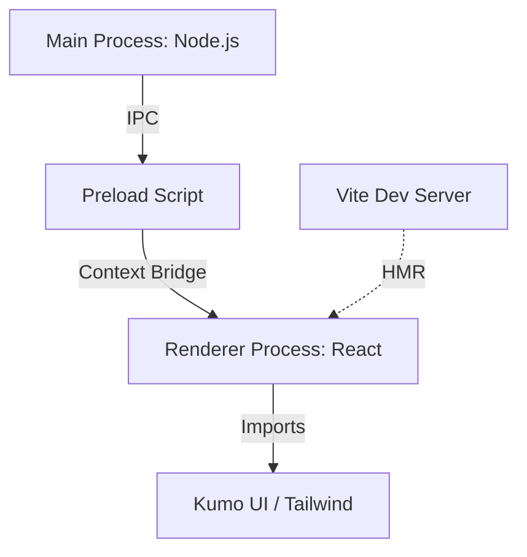

# Cavalry Patcher: Kumo UI 接入与架构演进方案

> **Philosophy**: 简化是最高形式的复杂。代码是写给人看的，只是顺便让机器运行。
> **Status**: Draft / Pending Execution

## 1. 现象层：现状诊断 (Current State)

目前项目处于“原始工业时代”：
- **技术栈**：纯粹的 Vanilla JS + 原生 HTML/CSS。
- **痛点**：
  1. **UI 限制**：手动操作 DOM 导致逻辑与视图高度耦合。
  2. **外观控制**：Dark/Light 模式依赖系统级 API，缺乏应用内的原子化控制。
  3. **扩展性**：接入现代组件库（如 Kumo UI）存在天然的范式冲突。

## 2. 本质层：架构演进 (Target Architecture)

将渲染进程从“静态文件加载”演进为“构建驱动的模块化架构”。

### 核心变更：引入 Vite + React
- **Vite**：作为构建引擎，提供极速的 HMR 和按需打包能力。
- **React**：作为 Kumo UI 的宿主，负责声明式的 UI 渲染。
- **Kumo UI**：提供现代、高溢价感的基础组件。

### 拓扑结构

## 3. 哲学层：设计契约 (Design Contract)

1. **单一真相源 (SSOT)**：所有 UI 状态由 React State 管理，不直接操作 DOM。
2. **供应商隔离 (Vendor Isolation)**：建立 `src/components/ui` 抽象层，封装 Kumo UI 组件，防止未来库变更导致的大规模重构。
3. **极简边境**：`preload.js`仅暴露必要的安全接口，不传递任何复杂的对象。

## 4. 设计令牌对齐 (Design System Alignment)

为了确保 UI 的溢价感，必须深度还原 Kumo UI 的设计语言：

### 4.1 颜色令牌 (Color Tokens)
- **语义化映射**：不使用硬编码颜色（如 `#ffffff`），必须映射到 Kumo 的语义变量（如 `--kumo-color-surface-primary`）。
- **动态适配**：颜色令牌必须支持内生的 Dark/Light 切换，通过 CSS Variables 实现一处修改，全屏响应。
- **重点关注**：Accent Color（强调色）必须符合 Kumo 的品牌调性，确保交互反馈的视觉一致性。

### 4.2 文字特征 (Typography)
- **字体族 (Font Stack)**：引入 Kumo 推荐的现代字体栈，优化中英文字体的渲染质感。
- **排版刻度 (Type Scale)**：严格遵循 Kumo 的字阶规范（Size, Line-height, Tracking），消除原生 HTML 默认缩放的廉价感。
- **字重特征**：区分关键信息的 Medium/Semibold 与辅助信息的 Regular，建立视觉层级。

## 5. 执行路径 (Execution Path)

### Phase 1: 基础设施搭建
- 初始化 Vite 配置 `vite.config.js`。
- 升级 `package.json`，整合 `vite` 与 `electron-builder` 流程。
- 配置 Tailwind CSS 环境（Kumo UI 的底色）。

### Phase 2: 渲染进程重构
- 建立 `src/renderer` 目录。
- 将 `app.js` 的补丁逻辑重构为 React Hooks (`usePatcher`)。
- 引入 `ThemeProvider` 实现 Dark/Light 模式的平滑切换。

### Phase 3: UI 精度修复
- 使用 Kumo UI 的 `Button`, `ProgressBar`, `Card` 等组件替换原生元素。
- 实现基于 Kumo UI 预设的全局样式，确保“高溢价感”视觉体验。

## 5. 品味自检 (Quality Metrics)

- [ ] **是否消除分支**：通过 React 的条件渲染替代大量的 `if/else` DOM 操作。
- [ ] **是否文件冗余**：Vite 必须配置 Tree Shaking，确保打包体积不膨胀。
- [ ] **是否架构失忆**：更新完成后，同步更新根目录 `CLAUDE.md` 以反映新的模块边界。

---
**Linus Note**: "Talk is cheap. Show me the code. But before the code, show me the design."
