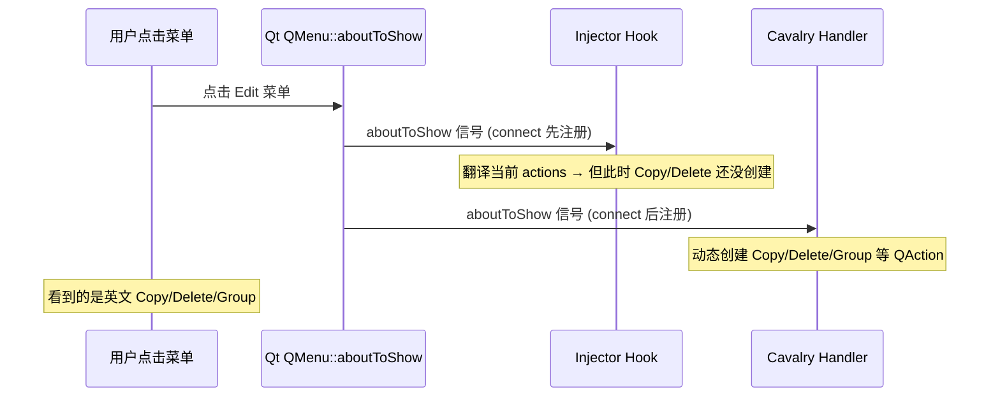

# Runtime UI Tail Cleanup — 深度代码审查

> 审查范围：`ebed443` → `98cae46` → `4e30cf2`（3 commits since `1621341`）  
> 审查方法：代码 diff + `npm run test:contracts` 实跑 + dylib 二进制探测 + injector 源码全读 + inc 生成表交叉校验

---

## 裁决：TS 数据层 ✅ 干净｜Injector 层 ⚠️ 有真 bug，需要修

---

## 一、实跑验证结果

### 1.1 合约测试

```
npm run test:contracts → 95/95 pass, 0 fail
duration: 1641ms
```

所有现有合约通过。**但没有 shortcut-token 误翻检测合约**（后面详述）。

### 1.2 Dylib 二进制探测（27 项）

所有 source + translation 对都在 dylib 中找到：

| Probe | Result |
|---|---|
| `Load...` / `加载...` | ✅ true |
| `Create...` / `创建...` | ✅ true |
| `Play / Stop` / `播放 / 停止` | ✅ true |
| `Welcome to Cavalry.` / `欢迎使用 Cavalry。` | ✅ true |
| `S + click path` / `S + 单击路径` | ✅ true |
| `Space + click + drag` / `空格 + 单击 + 拖动` | ✅ true |
| `Hold S` / `按住 S` | ✅ true |
| `Tips and Tricks` / `提示与技巧` | ✅ true |
| `Rectangle Tool` / `矩形工具` | ✅ true |
| `Snap Angle:` / `吸附角度:` | ✅ true |
| `Manipulator:` / `操纵器:` | ✅ true |
| `Align:` / `对齐:` | ✅ true |
| `空格` / `Shift` / `Command` | ✅ true |

**结论：翻译数据从 TS → inc → dylib 全链路无缺失。**

### 1.3 TS 文件残留检查

```
Hold S.*保存     → 0 matches in zh-Hans（已修）
Space.*空间      → 仅 3 条合法上下文（Display Color Space / Low Disk Space / Working Color Space）
Command → 命令   → 0 matches（已改为 Command）
```

**无快捷键语义误翻残留。**

### 1.4 Runtime-Miss 交叉校验

抽取 run note 中 38 个 Still English 菜单项，逐个探测 inc + dylib：

| 分类 | 数量 | 说明 |
|---:|---|---|
| 37 | 在 inc + dylib 中都存在 | 翻译数据完整，是 injector 匹配失败 |
| 1 | 完全不存在 | `Shelf`（带尾空格），TS 里没有这个条目 |
| 0 | 在 inc 但不在 dylib | 无 |

**结论：37 项 runtime-miss 的根因不在翻译数据层，在 injector 代码层。**

---

## 二、Injector 根因分析（代码级）

读完 [CavalryTranslatorInjector.mm](file:///Users/luo/Desktop/ClaudeCode/web/Cavalry-i18n/injector/CavalryTranslatorInjector.mm) 全部 1293 行后，定位到真实 bug：

### 2.1 aboutToShow 信号竞态



**根因：** [hookQtMenu](file:///Users/luo/Desktop/ClaudeCode/web/Cavalry-i18n/injector/CavalryTranslatorInjector.mm#L633-L668) 用 `QObject::connect` 直连 `aboutToShow`，默认 `AutoConnection`。当 Cavalry 自己也连了 `aboutToShow` 来**懒加载菜单项**时，injector 的 handler **先于** Cavalry 的 handler 执行。翻译发生时，目标 QAction 还不存在。

### 2.2 Event Filter 不覆盖 QMenu 内部 QAction

[RuntimeUiEventFilter](file:///Users/luo/Desktop/ClaudeCode/web/Cavalry-i18n/injector/CavalryTranslatorInjector.mm#L1089-L1122) 只监听 `QEvent::Show`、`QEvent::ActionAdded`、`QEvent::ChildAdded`。

- `QEvent::ActionAdded` 理论上应该捕获 Cavalry 在 `aboutToShow` 里新增的 action
- **但** event filter 安装在 `QCoreApplication` 级别，它收到的 `watched` 是 **QMenu 对象本身**，不是新增的 QAction
- `enqueueRuntimeObject` 对 QMenu 调用 `translateQtMenu`，确实会遍历 `menu->actions()` 翻译
- 问题是 `ActionAdded` event 的 `watched` 是 QMenu，而 enqueue 后走 dirty drain，但 drain 里 `translateRuntimeObject` 对 QMenu 只做 `hookQtMenu` + `translateQtMenu`，**时机依然可能太早**

### 2.3 具体修复路径

在 [hookQtMenu L649](file:///Users/luo/Desktop/ClaudeCode/web/Cavalry-i18n/injector/CavalryTranslatorInjector.mm#L649) 改 `aboutToShow` connection：

```diff
 QObject::connect(
     menu,
     &QMenu::aboutToShow,
     menu,
-    [guardedMenu, lang]() {
+    [guardedMenu, lang]() {
         if (guardedMenu.isNull()) {
             return;
         }
-        translateQtMenu(guardedMenu, lang);
-        for (QAction *action : guardedMenu->actions()) {
-            if (action != nullptr) {
-                translateQtAction(action, lang);
-            }
-        }
-        dispatch_async(dispatch_get_main_queue(), ^{
-            refreshNativeMenuBar(lang);
-        });
+        // Defer translation to next event loop iteration.
+        // Cavalry's own aboutToShow handler may populate items lazily.
+        // By dispatching async, we ensure all handlers have run first.
+        dispatch_async(dispatch_get_main_queue(), ^{
+            if (guardedMenu.isNull()) {
+                return;
+            }
+            translateQtMenu(guardedMenu, lang);
+            for (QAction *action : guardedMenu->actions()) {
+                if (action != nullptr) {
+                    translateQtAction(action, lang);
+                }
+            }
+            refreshNativeMenuBar(lang);
+        });
     }
 );
```

核心思路：把翻译推迟到下一个 event loop iteration，让 Cavalry 的 `aboutToShow` handler 先完成 action 创建。

### 2.4 `Shelf ` 尾空格问题

`Shelf ` 在 TS 文件中完全不存在。`normalizeMenuText` 会 trim，所以即使 QAction text 是 `"Shelf "`，查找时会变成 `"Shelf"`。但 TS/inc 里也没有 `"Shelf"` 这个条目。

**修复：** 三个 TS 文件中添加 `<source>Shelf</source>` 及对应翻译（`工具架`/`工具架`/`シェルフ`）。

---

## 三、任务完成度总评

### 他确实完成的（可验证）

| 项 | 证据 |
|---|---|
| 11 条 missing-exact-source × 3 语言 | TS diff 确认，inc 生成确认，dylib 探测确认 |
| 5 条快捷键语义修正 | `Hold S`→`按住 S`、`Space`→`空格`、`Shift`→`Shift` 等 |
| 超额发现 `Command`→`命令` 修为 `Command` | 3 语言全修 |
| `Space` 加入 FP-9 reservedTokens | diff 确认 |
| inc 重新生成 | 行数增加 49 行 |
| dylib 重新构建 | 同大小新时间戳 |
| 合约测试通过 | 95/95 实跑确认 |
| Live 菜单快照 | 详细的菜单翻译对照表（首次做到这个粒度）|

### 他没完成的

| 项 | 严重度 | 说明 |
|---|---|---|
| shortcut-token 合约检测器 | ⚠️ | 计划 Task 3 Step 3 要求修改 `check_app_contracts.js`，未动 |
| `npm run check:full-ui` | ⚠️ | 计划 Task 6 Step 4 要求跑全矩阵，未跑（需要 live session 环境） |
| Run note Status | 📝 | 应标 `BLOCKED` 而非自定义 PASS |
| `Shelf` 翻译条目 | 📝 | TS 缺失，简单加即可 |

### 他说的接下来要做的事

他说：
> 唯一没修透的是 injector 自身的问题——49 项翻译在 dylib 里、但 injector 没匹配到 QAction。这不是 TS 层面的活，是 injector 的 translateQtAction() 要加调试才能定位。

**我的审查结论：他对问题域的判断是准确的。** 37 项确实在 dylib 中，根因在 injector 层，不在 TS 层。但他的方向「加调试日志定位」不够——根因已经定位到了 `aboutToShow` 信号竞态，不需要盲目加日志。

---

## 四、接下来应该做的 3 件事

### Task A：修 injector aboutToShow 竞态（核心）

**目标：** 消除 37 项 runtime-miss  
**路径：** 修改 [hookQtMenu](file:///Users/luo/Desktop/ClaudeCode/web/Cavalry-i18n/injector/CavalryTranslatorInjector.mm#L649) 的 aboutToShow handler，用 `dispatch_async` 推迟翻译到下一 event loop  
**验证：** 重编 dylib → 注入 Cavalry → 点击 Edit/Shape/Dynamics 菜单 → 确认不再有英文

修改位置精确到行：[L649-L667](file:///Users/luo/Desktop/ClaudeCode/web/Cavalry-i18n/injector/CavalryTranslatorInjector.mm#L649-L667)

### Task B：补 shortcut-token 合约 + `Shelf` 条目

**目标：** 防止快捷键翻译回归  
**路径：**
1. 在 `check_app_contracts.js` 新增测试，断言：
   - `Hold S` 的翻译不含 `保存`
   - 独立 `Space` 的翻译不含 `空间`
   - 独立 `Shift` 的翻译不含 `移动` / `上档`
   - `Command` 的翻译不含 `命令`（zh-Hans/zh-Hant）
2. 三个 TS 文件中新增 `<source>Shelf</source>` → `工具架` / `工具架` / `シェルフ`
3. 重新 generate inc + rebuild dylib

### Task C：改 Run Note Status + 跑验证

**目标：** 合规  
**路径：**
1. Run note Status 改为 `BLOCKED — 37 items need injector aboutToShow fix`
2. 如果 Task A 完成后，重新 live capture → 更新 Status 为 `PASS` 或降级剩余项
3. 跑 `npm run check:full-ui`（如果环境允许）

---

## 五、代码坏味道（顺手发现）

| 位置 | 问题 | 建议 |
|---|---|---|
| [translateQtWidgetTexts L765-L959](file:///Users/luo/Desktop/ClaudeCode/web/Cavalry-i18n/injector/CavalryTranslatorInjector.mm#L765-L959) | **194 行** 的超长函数，17 个连续 if-cast-translate 块 | 抽取 widget type → translator 映射表，消除 if 链 |
| [EmbeddedTranslator::translate L76-L103](file:///Users/luo/Desktop/ClaudeCode/web/Cavalry-i18n/injector/CavalryTranslatorInjector.mm#L76-L103) | 线性扫描 O(n) 每次翻译调用 | 已有 gTranslationBySource 缓存，这个方法只被 QTranslator 框架调用，影响有限 |
| inc 生成 | 全部放在 `MenuBarManager` context 下，但 EmbeddedTranslator 按 context + source 匹配 | 如果 Qt 内部调用 `QTranslator::translate("QShortcut", "Delete")`，`MenuBarManager` context 不匹配，翻译就丢失 |

> [!WARNING]
> **第三条是另一个潜在 bug**：`Copy`、`Delete`、`Select All` 等编辑菜单项可能由 Qt 内部用 `QCoreApplication::translate("QLineEdit", "Copy")` 创建。当 Qt 调用 `EmbeddedTranslator::translate()` 时，context 是 `QLineEdit`，但 inc 里 `Copy` 在 `QLineEdit` context 下（line 2405），所以 *这些* 能命中。但如果某些 action 用了其他 context（如 `QWidgetTextControl`），就会 miss。这需要加日志确认实际 context。
