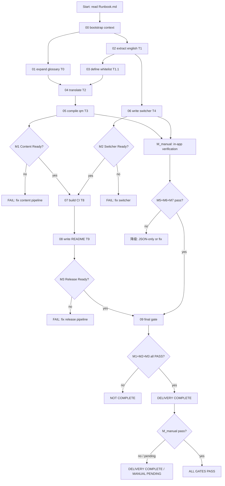

<!--
[INPUT]: 依赖 Runbook.md、Project.md、Acceptance.md、tests/* 与 prompts/* 的端到端约束
[OUTPUT]: 对外提供 cavalry-i18n workflow 的流程图与 gate 关系
[POS]: cavalry-i18n 工作流的可视化地图
[PROTOCOL]: 变更时更新此头部，然后检查 CLAUDE.md
-->

# Flow

## End-to-End Flow

## Gate Ownership

| Gate | Stage | Purpose | Must Fail When |
|---|---|---|---|
| Glossary | T0/M1 | 术语一致性 | 空单元格、简繁差异缺失 |
| Extraction | T1/M1 | 英文原文完整 | JSON 缺失或不可解析 |
| Whitelist | T1.1/M1 | 翻译范围明确 | 文件类型未覆盖 |
| Translation | T2/M1 | 翻译质量 | key 不一致、术语不匹配、占位符丢失、叶子字符串残留英文 |
| QM Compile | T3/M1 | .qm 可用 | 文件缺失或为空 |
| Switcher | T4/M2 | 脚本功能完整 | 缺 API 调用、缺平台处理 |
| CI | T8/M3 | 自动编译 | 缺 lrelease 或 release |
| README | T9/M3 | 文档完整 | 缺必要章节 |
| In-App | M_manual | 实际效果 | 目视不通过 |

## Parallel Tracks

T8（CI）/ T9（README）与 M_manual（In-App Verification）是并行的两条轨道，互不阻塞。

- **自动化轨道**：M1 + M2 通过后 → T8 → T9 → M3 检查
- **手动验证轨道**：T3 + T4 完成后 → M5/M6/M7 目视验证

两条轨道均完成后汇入 09 final gate。M_manual 不通过时可降级为 JSON-only 方案，不阻塞 M3。

最终表述规则：

- **DELIVERY COMPLETE**：M1 + M2 + M3 通过，M_manual 未完成或未通过
- **ALL GATES PASS**：M1 + M2 + M3 + M_manual 全部通过
