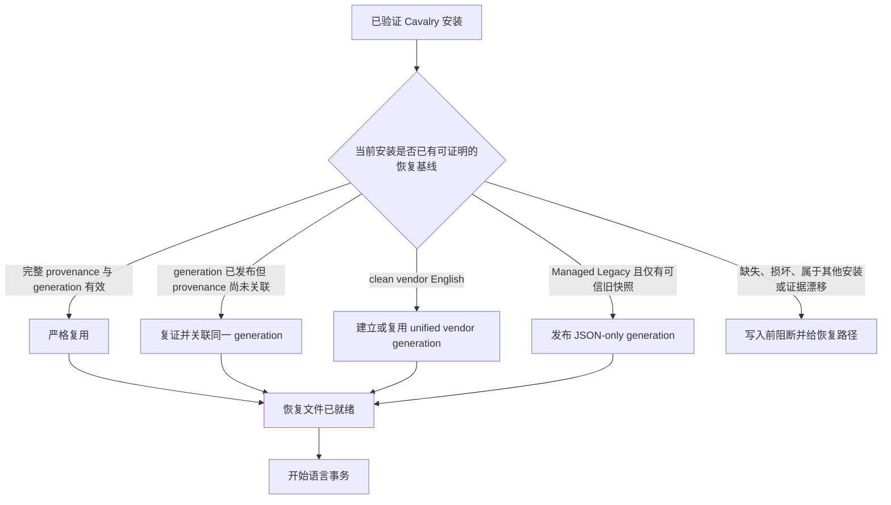

<!--
[INPUT]: 依赖 renderer/app.js 的任务状态机、src-tauri/src/commands/apply.rs 与 snapshot/snapshot_legacy 的恢复基线闸门、macOS 官方/受管旧版还原、Windows English/QPA 清理事务，以及 2026-08-29 至 2026-09-01 产品与 UX Writing 裁决
[OUTPUT]: 对外提供“首次 Switch 自动建立或严格复用恢复基线、已发布未关联 generation 的可重入收敛、显式选择目标语言、Switch 无确认直达、单一 Restore English、Managed Legacy 与版本兼容门禁、400×484 无窗口滚动布局”的详细产品/工程决策、状态拓扑、平台映射、失败边界与验收合同
[POS]: docs/audits 的决策证据；事件簿只保留摘要并链接本文，代码与后续回归以本文解释为何删除手动 Refresh/双恢复入口，以及为何受管旧安装不得被误报为必须重装
[PROTOCOL]: 变更时更新此头部，然后检查 CLAUDE.md
-->

# Switcher 直接 Switch、自动恢复基线与单一 Restore English 决策

日期：2026-08-29
状态：2026-08-31 兼容性修订已落地并通过 focused 回归；当前 macOS native 只读状态、package/manual smoke 与 Windows live 仍按各自证据门补齐

## 1. 问题

旧界面把底层实现拆成三个用户动作：

1. `Refresh English`
2. `Restore English`
3. `Restore Official`

这套表面结构把恢复基线、语言结果和安装实现细节混为一谈。用户必须先理解 snapshot、managed runtime、官方 runtime/signature 等内部概念，才能判断应点哪个按钮。更严重的是，后端早已在非英文 Apply 写事务前自动建立或复用恢复基线，renderer 却用 `needsExtract` 禁用并拦截 Apply，制造了一个并非业务必需的手动步骤。

## 2. 当前代码事实

### 2.1 Apply 已拥有自动基线能力

`src-tauri/src/commands/apply.rs` 的非英文事务在写入语言资产、runtime 或 marker 前调用 `extract_english_snapshot_or_throw`。该闸门只接受以下证据：

- 可验证的 clean vendor English 安装，可据此建立 immutable generation；或
- 与当前 Cavalry immutable revision 匹配、provenance 完整的既有恢复基线。

若证据不足，事务在任何 Cavalry 写入前失败。自动化不降低 fail-closed 标准，也不把当前已翻译文件误采为原始英文。renderer 的 `needsExtract` 只用于说明准备状态，不再阻断 clean official install 的 Apply。

### 2.2 “恢复基线”不是备份整个 Cavalry

保存范围只覆盖本项目将修改、恢复或删除时需要证明的原始材料：keyed English JSON、平台 runtime/QPA preimage、macOS Info/main/CodeResources/ExtensionLayer 与签名身份等。产品文案不得使用没有范围限定的“备份 Cavalry”，也不得向普通用户暴露 snapshot/provenance。

### 2.3 macOS 恢复结果取决于可证明的基线等级

- 受管英文恢复：写回已证明的 English JSON 与 English marker，但保留 Switcher 管理的 launcher、injector、Keychain patch 和本地重签状态。
- 官方恢复：只有完整 vendor runtime/signature preimage 可证明时，才恢复官方 English 文件与 vendor runtime/signature，并移除 Switcher 自有 runtime。

用户目标只有一个：恢复英文。UI 不让用户裁决内部恢复等级；后端依据证据选择最强且诚实的结果。没有完整 vendor baseline 时，不得把“受管英文”谎称为“官方英文”，也不得因此拒绝一个已经由本项目管理、仍可安全切换的旧安装。

### 2.4 “受管证据”与“官方恢复证据”必须分离

旧版 Switcher 生成的 macOS 安装可能同时满足：

- 当前 Cavalry 仍能正常启动；
- state、语言 marker、旧 English JSON、launcher、injector、Keychain patch 与 ad-hoc 签名共同证明这是本项目的已知 postimage；
- 但旧版本没有保存后来才引入的完整 vendor runtime/signature baseline。

这类状态定义为 **Managed Legacy**。它证明“本项目可以继续管理”，却不证明“可以逐字节恢复官方 vendor runtime”。旧实现把两种证明压成 `modifiedOrUnverified + needsExtract`，于是把自己的已知安装误报为 `Reinstall Cavalry`。修订后的模型必须分别表达：

1. 是否是 Switcher 可证明的受管安装；
2. 是否有可用的 English language baseline；
3. 是否有完整 official recovery baseline；
4. 是否处于未知 drift 或事务恢复状态。

Managed Legacy 可以继续四语切换，也可以恢复到受管英文；未知修改仍 fail closed。仅“应用能打开”不是受管证明，不能替代上述严格证据组合。

首次真实 Apply/Restore 不得只在 UI 上宣称可用：它会把已证明的旧 `state_dir/en` 提升为 immutable JSON-only generation，并将 generation + manifest 写入 provenance。macOS 提升前还要求 packaged English、旧快照与当前已安装 JSON 三方 Unix mode 完全一致；迁移字节只来自旧 English 快照，绝不从当前翻译安装反向提取。迁移后的后续启动继续用同一 generation、已发布 runtime postimage 与 marker 复证，`vendorBaselineId` 仍为空，因此 Restore 只能诚实地表示受管英文恢复。

generation 发布与语言写事务不是同一个原子动作：系统权限可能在 generation 已经持久发布、但最终语言事务尚未把其 identity 写回 `state.json` 时阻断。这个状态不是“无法备份”，也不能再次迁移。下一次 Apply 必须用当前安装根、immutable revision、manifest/hash、packaged English overlay、已发布 runtime postimage 与 marker 重新证明该 generation；全部成立后，把同一 identity 投影回本次事务继续执行。任一证据不成立才 fail closed。

关联完成后仍有第二个边界：macOS 的 `provenance_needs_refresh` 只回答“完整 official vendor baseline 是否新鲜”，不能回答“Managed Legacy 的 JSON-only English generation 是否可用于本次语言恢复”。Apply 必须先用上述 Managed Legacy 全套证据复证；若 provenance 已包含 generation + manifest、`vendorBaselineId` 为空且复证通过，就直接复用该 generation。只有它不是可信 Managed Legacy 时，才进入 clean vendor capture。否则系统会错误地尝试从当前已翻译安装重新捕获英文，并把合法旧安装误报为“无法准备恢复文件”。Restore English 使用同一判断，不能在同一恢复基线上与 Switch 产生不对称结果。

### 2.5 恢复基线状态拓扑与用户事件



用户不需要区分创建、复用和关联修复。三条成功分支统一显示：

```text
正在准备恢复文件
恢复文件已就绪
```

这里的“准备”表示为**本次任务验证恢复能力**，不是承诺每次重新复制文件；“已就绪”表示恢复基线此刻与所选 Cavalry 安装身份一致。显示“以前已经备份过”反而会掩盖安装升级、路径变化或文件漂移，因此不采用。只有 `X` 分支才显示错误；后端内部 generation、snapshot、provenance 不进入普通用户文案。

### 2.6 重复 Apply 的签名范围根因与修复证据

`src-tauri/src/detect.rs` 当前的 code identity 只把签名载荷、`LC_CODE_SIGNATURE` 字段，以及由签名末端明确证明的 `__LINKEDIT` extent 视为可归一化内容；无关的 `__LINKEDIT` extent 仍是身份材料。

根因是允许的 re-sign 会改变签名载荷大小，并同步改变签名末端的 `__LINKEDIT` `vmsize/filesize`。若把这些签名相关范围按原始字节直接比较，第二次 Apply 会把同一份可执行代码误判为 drifted。当前 `detect::tests` 5/5 PASS，且 `/tmp` disposable Cavalry 副本的首次/重复 Apply 均成功。以上是 focused evidence：它证明身份归一化与重复 Apply 路径，不证明当前候选已完成正式 macOS manual smoke 或 packaged/native PASS。

### 2.7 Renderer 与 command 边界

当前 Tauri renderer-facing command registry 与 Rust builder 均为 9 条：status、browse、apply、privacy、固定 project link、show About、restart、check update、install update。手动 English extraction 不是 bridge/API 能力；`extract_english_inner` 仅保留为 Rust 测试内部 seam，不能由 renderer 触发。

## 3. 产品决策

### 3.1 单一任务流

```text
Switch to
[ Select：未选择时显示本地化占位文案，占满两列总宽 ]
[ Switch ][ Restore English ]
[ Activity Log ]
```

删除 `Recovery` 标题、手动 `Refresh English`、旧 `Restore English` 与 `Restore Official` 双入口；只保留一个结果明确的 `Restore English` 动作。Select 初始不暗中预选语言，显示本地化占位文案；当前已生效语言仍在列表中可见但禁用，其他语言可选，用户明确选择后才启用 Switch。两个动作等宽，Select 与两个按钮加间距后的总宽一致。

### 3.2 平台映射

| 用户动作 | macOS 内部 action | Windows 内部 action | 用户可见结果 |
| --- | --- | --- | --- |
| Switch | 目标语言，例如 `zh-Hans` | 目标语言，例如 `zh-Hans` | 自动保存必要原文件，切换语言并打开 Cavalry |
| Restore English（完整官方基线） | 官方恢复事务 | `en` | 恢复官方英文可运行状态，清理 Switcher 翻译 runtime，并打开 Cavalry |
| Restore English（Managed Legacy） | 受管英文事务 | 不适用 | 写回可信 English JSON、停用当前翻译状态并打开 Cavalry；不虚假宣称 vendor 官方恢复 |

这里统一的是用户意图与结果，不是强迫两平台共享同一内部 transaction 名称。保留现有、已验证的平台事务，比新造一个跨平台伪抽象更简单可靠。

### 3.3 Switch 直接执行，不拆分“现在/稍后重启”

`platform_runtime::preflight_apply` 与 `commands/apply.rs` 的 typed preflight 已经保证：Cavalry 仍在运行时返回稳定 `cavalryStillRunning`，并明确声明没有文件被写入；事务不会强停用户正在使用的 Cavalry。只有 Cavalry 已关闭，后端才会写入并在完整事务末尾调用现有 restart 编排重新打开它。

因此用户点击 `Switch` 后直接进入任务事件流，不再先显示“安装语言包”确认框，也不提供“现在重启 / 稍后重启”分叉：

- 运行中：事件视窗要求保存并关闭 Cavalry 后重试，不发生修改或意外退出。
- 已关闭：切换完成后自动打开 Cavalry，让用户立即看到结果。
- “稍后重启”会制造已经改写但未验证结果的半完成体验，并引入 pending 状态、再次启动入口与恢复分支，没有独立用户价值。
- renderer 仍消费后端 `restartCavalry` phase，但面向用户投影为 `Opening Cavalry`；这是对真实结果的描述，不把内部函数名当产品文案。

Restore、Switcher Update 与系统权限仍保留 AlertDialog：它们分别涉及撤除受管 runtime、自替换安装和操作系统授权，确实需要用户作出风险选择。

### 3.4 可见状态

- clean official English：Select 可用；用户明确选择目标语言后 Switch 才启用，若尚无基线，首次 Switch 自动准备。Restore English 禁用，因为没有需要恢复的修改。
- translated/managed：Select 保留显示当前语言并将其禁用，其他目标语言可选；当前语言不是 English 时 Restore English 可用，已经处于受管 English 时禁用，因为用户目标已经成立。
- Windows residue/reconciliation required：Event 明确要求 Restore English；该动作映射为 English + vendor QPA/generic cleanup。
- macOS Managed Legacy：Select 与 Switch 可用；非英文时 Restore English 可用，已是英文时禁用；不显示重装警告，不显示会暴露内部实现的“旧版受管”徽章。
- macOS unknown modified 且没有可信受管/英文/官方基线：Apply 和 Restore 均 fail closed，Activity 说明无法安全修改；只有确实需要替换安装时才要求官方重装。
- 版本低于 2.7.2：保持只读，不修改安装；说明当前 Switcher 只支持 2.7.2，若要使用本工具需安装 2.7.2。
- 版本高于 2.7.2：保持只读，不修改安装；明确“尚未支持”，不要求用户降级，允许用户继续正常使用当前 Cavalry，并等待兼容的 Switcher 更新。
- 无法比较版本：保持只读，说明当前安装未被修改以及唯一受支持版本，不猜测升级/降级方向。
- state durability pending：禁止继续写操作，Alert 要求重启 Switcher，不再要求用户刷新英文。
- startup transaction recovery failed：所有 Cavalry mutation 阻断，底层错误不直接显示给用户。

## 4. 文案合同

- Select 初始使用 `Choose a language / 选择语言 / 選擇語言 / 言語を選択` 占位文案，不把列表第一项伪装成用户选择；Switch 在选择前禁用。
- 当前已生效语言留在 Select 列表中并以 disabled 状态表达“这是有效语言，但无需重复切换”；不得删除该选项，也不得允许再次提交。
- 按钮只写用户目标：`Switch / 切换 / 切換 / 切り替える` 与 `Restore English / 恢复英文 / 還原英文 / 英語に戻す`；恢复按钮必须写明对象，但不把 restart 或平台事务实现塞入按钮。
- Switch 不弹确认框；任务引言先写 `Preparing to switch to {language}…`，正文阶段说明恢复文件与切换进度。
- Restore 确认的标题、正文与主按钮统一围绕 `Restore English`：标题直接问 `Restore English?`，正文只承诺“Cavalry 恢复为英文并重新打开”。不得用 `Restore Cavalry?` 暗示整个应用会恢复为逐字节官方状态；仅完整官方基线路径可以在扩展说明中补充“移除翻译 runtime/恢复官方状态”。
- 新版本不兼容提示必须以用户现状为中心：说明“此 Switcher 尚未支持该版本、没有修改安装、可以继续使用 Cavalry、等待兼容更新”，禁止把“降级到 2.7.2”写成默认恢复路径。
- 旧版本提示可以把 2.7.2 作为使用本工具的前提，但不能暗示当前 Cavalry 已损坏。
- 后端 restart phase 统一显示为“打开 Cavalry”；只有 Switcher 自身更新才继续使用“重启 Switcher”。
- Alert 标题表达结果、风险或下一动作；正文只补充影响和恢复路径。
- 禁用用户文案：`Refresh English`、`Backup Cavalry`、`snapshot`、`provenance`、`managed runtime`。

## 5. 布局与滚动合同

- Tauri 窗口配置：`400×484`，`minWidth=400`、`minHeight=484`；新增 4px 全部归入 176px Activity 框。
- 标题栏高度由 16px 交通灯与上下各 12px 推导为 40px；内容四周 padding 为 20px。
- 主任务流通常使用 20px 间距，`Switch to` 与 Select 使用 8px 字段关系；Select 与按钮高度为 36px；双动作轨道为 `170px + 20px + 170px = 360px`，正好等于 `400px - 2×20px`。
- 复合二维关系由 Grid 管理（Select 跨两列、Switch/Restore 同行）；一维标题/内容流由 Flex 管理。
- 主窗口禁止横向和纵向滚动：`html`、`body` 与 `.content` 均不得成为窗口滚动容器。窗口尺寸必须容纳正式四语内容，不得以裁剪或隐藏必要内容换取无滚动。
- Select 弹层与 Activity Log 各自在自身有界区域内滚动，不属于窗口滚动。
- Activity Log 保持固定结果区域；只有 Restore、Updater、权限与危险操作进入独立 AlertDialog，正式四语文案不得撑开主窗口。

## 6. 被否决的方案

1. **保留 Refresh 作为“高级功能”**：没有独立用户目标，只重复 Apply 的前置能力，增加状态分叉。
2. **把按钮改成 Backup / Restore**：保存范围不是整个应用，`Backup` 会制造错误承诺。
3. **保留 Restore English 和 Restore Official 两个按钮**：要求用户理解实现状态，两个结果在体感上高度重叠，且容易留下“英文但仍被管理”的中间态。只保留一个名为 Restore English 的入口不属于该方案。
4. **新造统一 Rust action 名称后再实现**：当前平台事务已存在且语义明确；只在 renderer 意图层统一，符合 KISS/YAGNI。
5. **让主窗口滚动兜底**：紧凑桌面工具的主任务必须一屏完成；滚动会隐藏 Alert 或动作，掩盖窗口尺寸和文案失控。若列表选项过多，只允许 Select 弹层自身滚动。
6. **保留 Switch 确认框**：语言切换可由 Restore 退出，且运行中 preflight 在写入前阻断；重复确认没有保护新增风险，只延迟主任务。
7. **提供“现在重启 / 稍后重启”**：后端并不强停运行中的 Cavalry；已关闭时重新打开是完成用户目标的一部分。拆分只会制造 pending 半状态和额外状态机。
8. **把另一按钮写成“取消翻译”**：操作发生前应是普通 Cancel，操作完成后撤销结果应是 Restore；“取消翻译”既不对应稳定时态，也误导为内容翻译任务。
9. **凡无完整官方 baseline 都要求重装**：把恢复能力误当受管能力，惩罚已使用旧版 Switcher 的正常用户。
10. **对 2.7.3 用户要求降级**：以维护者实现边界替用户作版本选择；正确行为是停止写入、说明尚未兼容并让用户继续使用现有 Cavalry。

## 7. 当前验收清单

- [x] renderer 不再查询 `extractButton` / `restoreEnglishButton` / `maintenanceHeading`；当前 renderer/bridge focused 合同 44/44 PASS。
- [x] `window.cavalryI18n` 和 Tauri command 注册表不再暴露独立 `extractEnglish` / `extract_english`；内部测试 seam 不属于 bridge/API。
- [x] clean official + `needsExtract=true` 时 Select 仍可用；用户明确选择后 Switch 可点击并调用 `apply_language`，renderer/bridge 测试覆盖该路径。
- [x] macOS 有完整 vendor baseline 时 Restore 调用 `restore-official`；Managed Legacy 与 Windows 调用 `en`；renderer/bridge 测试覆盖三种映射，并验证受管英文结果不伪称官方恢复。
- [x] official English 且无 residue 时 Restore English 禁用但不隐藏，布局不跳动；renderer/bridge 测试覆盖该状态。
- [x] 四语主按钮已收敛为 `Switch / 切换 / 切換 / 切り替える` 与单一 `Restore English / 恢复英文 / 還原英文 / 英語に戻す`；Switch 点击不经过确认框而直接调用唯一 `apply_language` transaction，Restore/Updater/权限 AlertDialog 保留。
- [x] 运行中 fail-before-mutation 仍由后端 `cavalryStillRunning` 路径守住；renderer 不增加独立 restart 调用或 pending restart 状态。
- [x] Switch 准备、阶段、打开 Cavalry、成功和失败文案合同通过；内部 `restartCavalry` phase 不再直接暴露成用户“重启”文案。
- [x] `html/body/.content` 不产生窗口滚动；Select 与 Activity Log 各自独立滚动；renderer contract 检查 CSS 边界。
- [x] Node renderer/bridge focused 合同 44/44、Rust lib 153/153、command contract 6/6 PASS；Node 24.20 全量 `test:contracts` 263/263 PASS，Rust 全量 256 PASS / 2 个显式 live-artifact 测试 ignored。
- [x] p1-p5 macOS wrapper 字节与三组 release injector code identity 被固定为 allowlist；Managed Legacy 还要求匹配 marker、完整 Keychain postimage、历史 state/revision 与 38 份 packaged-English overlay。首次写操作以 packaged English 证明内容、以 legacy snapshot 与 installed asset 的 mode 互证本机厂商元数据后发布 JSON-only generation；语言包 checkout mode 不参与 vendor mode 判定。迁移后复证、已关联 generation 在 baseline 阶段的直接复用，以及 Switch/Restore marker-only runtime plan 均有聚焦测试，未知 injector、marker drift、generation tamper 与本机 mode drift 全部拒绝。
- [x] 2.7.1、2.7.3 与不可比较版本分别投影 older/newer/unknown 只读状态；新版本文案不要求降级，三态 renderer 测试均阻断 Switch/Restore。
- [x] 按当前 `400×484` 工作树重新拉起 macOS native dev；AX/CGWindow 外框为 `400×485`。真实旧 Switcher 管理态的只读截图 `/tmp/cavalry-managed-legacy-native.png` 显示 Select 与 Restore English 可用、不再出现 Reinstall；没有点击任何写操作。Activity 仍为 `360×176`、12px padding、94px 中段。
- [ ] 当前源码的 macOS package 与 ignored manual smoke；旧 `9766ee3` 的 `460×404` 只作历史且已失效。
- [ ] Windows live：真机窗口、scaling、Snap、状态保留与 updater 跨版本验证。

## 8. 当前验证证据

```text
mise x node@24.20.0 -- node --test tools/check_renderer_contract.js \
  tools/check_tauri_bridge_runtime.js                             40/40 PASS
cargo test --manifest-path src-tauri/Cargo.toml \
  --test command_contract                                             6/6 PASS
cargo test --manifest-path src-tauri/Cargo.toml --lib             151/151 PASS
cargo test --manifest-path src-tauri/Cargo.toml \
  --test tauri_config_contract                                         8/8 PASS
cargo test --manifest-path src-tauri/Cargo.toml \
  --lib commands::tests::registers_nine_commands                    1/1 PASS
cargo test --manifest-path src-tauri/Cargo.toml \
  --lib detect::tests                                             5/5 PASS
cargo check --manifest-path src-tauri/Cargo.toml                      PASS
mise x node@24.20.0 -- npm run test:contracts                    256/256 PASS
cargo test --manifest-path src-tauri/Cargo.toml                  249 PASS / 2 explicit live-artifact tests ignored
current native Tauri dev AX / CGWindow                            400×485 outer; Managed Legacy read-only screenshot `/tmp/cavalry-managed-legacy-native.png`
```

旧记录证明当时的静态 renderer/bridge 行为、9-command 注册和 `400×480` native 几何；当前 `400×484` 已重新运行合同和 native dev 取证，但仍不证明 package/manual smoke 或 Windows live。

历史 `9766ee3` packaged 记录：

- 旧窗口为 `460×404`，与当前源配置不一致。
- 该提交之后存在未提交 UI/逻辑变化，所以旧 packaged 结果不能推断当前候选；不写作当前 packaged PASS。
- 正式 ignored macOS manual smoke 仍需可验证 English 的 disposable Cavalry 输入。
