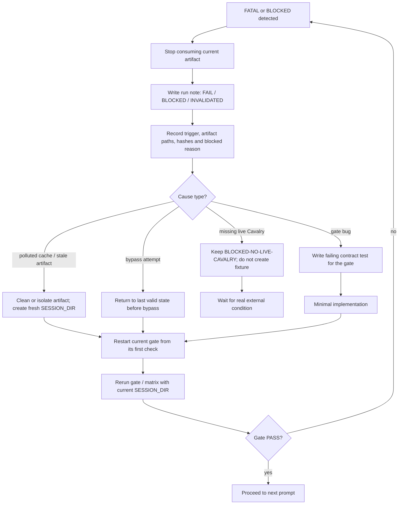

<!--
[INPUT]: 依赖 Project.md / Acceptance.md / Runbook.md
[OUTPUT]: 对外提供 full-ui-100 workflow 的流程图与 gate 归属
[POS]: full-ui-100 流程地图
[PROTOCOL]: 变更时更新此头部，然后检查 CLAUDE.md
-->

# Flow

## End-to-End Flow

```mermaid
flowchart TD
  START["Start: read EXECUTE.md"] --> TARGET{"Target identity current?"}
  TARGET -- "no" --> REFRESH["Invalidate old denominator; create fresh SESSION_DIR; re-extract/capture/freeze"]
  REFRESH --> TARGET
  TARGET -- "yes" --> BASELINE["Re-run current baseline detectors"]
  BASELINE --> AUDIT{"W-AUDIT review red flags cleared?"}
  AUDIT -- "no" --> FIX_AUDIT["Update tests to require whitelist-filtered 100 / reject 0.90 / require preflight / require libExtensionLayer"]
  FIX_AUDIT --> AUDIT
  AUDIT -- "yes" --> GP{"G-P provenance trustworthy?"}
  GP -- "no" --> FIX_GP["Create verify_gate_inputs / reject fixture, curated and root-cache runtime input"]
  FIX_GP --> GP
  GP -- "yes" --> P5{"§P5 forbidden patterns wired?"}
  P5 -- "no" --> FIX_P5["Hard-fail placeholder, fullwidth Latin, page-fill, script-mix, synthetic source, fake context and Frankenstein residue"]
  FIX_P5 --> P5
  P5 -- "yes" --> GCAP{"G-CAPTURE runtime capture ready?"}
  GCAP -- "no" --> FIX_GCAP["Enable English dump-only injector / session-dir launch / AX walk / merge toolchain"]
  FIX_GCAP --> GCAP
  GCAP -- "yes" --> GX{"G-X extraction inventory frozen?"}
  GX -- "no" --> FIX_GX["Extract JSON / compiled / runtime English surface and freeze denominator"]
  FIX_GX --> GX
  GX -- "yes" --> G0{"G0 Measurement Integrity?"}
  G0 -- "no" --> FIX_G0["Fix scripts / thresholds / runtime metadata / CI wiring"]
  FIX_G0 --> G0
  G0 -- "yes" --> G2{"G2 Compiled owner map trustworthy?"}
  G2 -- "no" --> FIX_G2["Add libExtensionLayer / tighten false-positive filter / regenerate source map"]
  FIX_G2 --> G2
  G2 -- "yes" --> G3{"G3 Runtime truth trustworthy?"}
  G3 -- "no" --> FIX_G3["Enforce language/source/timestamp/freshness / reject weak widget-only gaps / merge injector + AX inventory"]
  FIX_G3 --> G3
  G3 -- "yes" --> G1_READY{"G1 JSON strict gate ready?"}
  G1_READY -- "no" --> FIX_G1["Raise validator to 1.00 / require coveragePct=100 / tighten untranslated logic"]
  FIX_G1 --> G1_READY
  G1_READY -- "yes" --> ZHS["Clear zh-Hans backlog from frozen denominator"]
  ZHS --> ZHT["Clear zh-Hant backlog"]
  ZHT --> JA["Clear ja_JP backlog"]
  JA --> G1{"G1 JSON Surface 100?"}
  G1 -- "no" --> ZHS
  G1 -- "yes" --> G4{"G4 Matrix 100?"}
  G4 -- "no" --> ROUTER["Read run note + RUN_RECORD -> pick first failing gate"]
  ROUTER --> AUDIT
  ROUTER --> GP
  ROUTER --> P5
  ROUTER --> GCAP
  ROUTER --> GX
  ROUTER --> G0
  ROUTER --> G2
  ROUTER --> G3
  ROUTER --> G1_READY
  G4 -- "yes" --> PASS["ALL GATES PASS"]
```

## FATAL / BLOCKED Recovery Flow

## Gate Ownership

> **顺序澄清**: 上方流程图中 `G2 → G3 → G1` 是**修复顺序**（先补 compiled owner map，再补 runtime truth，最后收紧 JSON）。`npm run check:full-ui` / `check_full_ui_matrix.js` 实际一次跑完所有 surface（按语言 round-robin），不会按此顺序串行检测。

| Gate | Owner | Purpose | Must Fail When |
| --- | --- | --- | --- |
| W-AUDIT | package/test contracts + reviewer red flags | 防止旧弱口径被测试固定住 | 白名单外未达 100、`0.90`、缺 preflight、缺 `libExtensionLayer` 仍被测试接受 |
| G-P | `verify_gate_inputs.js` + session provenance | 防止 input 出处造假 | fixture/curated/input provenance 缺失、root-cache runtime input、session UUID 不一致 |
| §P5 | forbidden translation detector | 防止 translation/source/context 形态造假 | `（译）` / 全角拉丁 / `页:N` / 简繁串味 / 合成 source / 伪 context / Frankenstein 残留命中 |
| G-CAPTURE | injector + AX + merge runtime toolchain | 先让 live runtime 分母抓得全 | English dump-only 失败、session-dir 缺失、runtime candidates/menuLeaves 低于 A9B11073 基线、缺 `menuDepthMax` / submenu path samples |
| G-X | extraction inventory + frozen denominator | 防止未抽全就开始翻译 | JSON/compiled/runtime 任一 surface 低于 frozen lower bound、target identity 不一致，或后续 gate 换分母 |
| G0 | package scripts + detector wiring + CI handoff | 防止“检测存在但 workflow 不自洽” | package tests 红、threshold 弱、runtime metadata 缺失、CI 未接 full-ui |
| G1 | JSON validator + full-ui JSON gate | 防止 `90%` 弱阈值假绿 | coverage 仍可停在 `97-98%`、exact-English / residue / purity 仍存在 |
| G2 | compiled owner map + `.ts` | 防止漏扫 `libExtensionLayer` | 已知真实 UI 文本不在 source map |
| G3 | injector inventory + AX inventory + runtime metadata validation | 防止 runtime 100 循环论证 | 真实界面仍有英文但 gate 看不见，或 inventory 缺 `language/source/timestamp/freshness/widget/panel` 强校验 |
| G4 | matrix session run record + CI | 防止单语或单 surface 假完成 | 任一语种或 surface 仍失败，或 CI 未把 full-ui matrix 视为 workflow 真状态 |

## Provenance Rule

- `docs/archive/full-ui-100-chatlog-ref.md` 是本次审查/复核过程的历史证据留档
- 它可以解释“为什么把某些 blocker 升格为 workflow 基线”
- 但它**不是**当前 gate 的真相源；若与 `Project.md` / `Acceptance.md` / `Runbook.md` 冲突，以后三者为准
